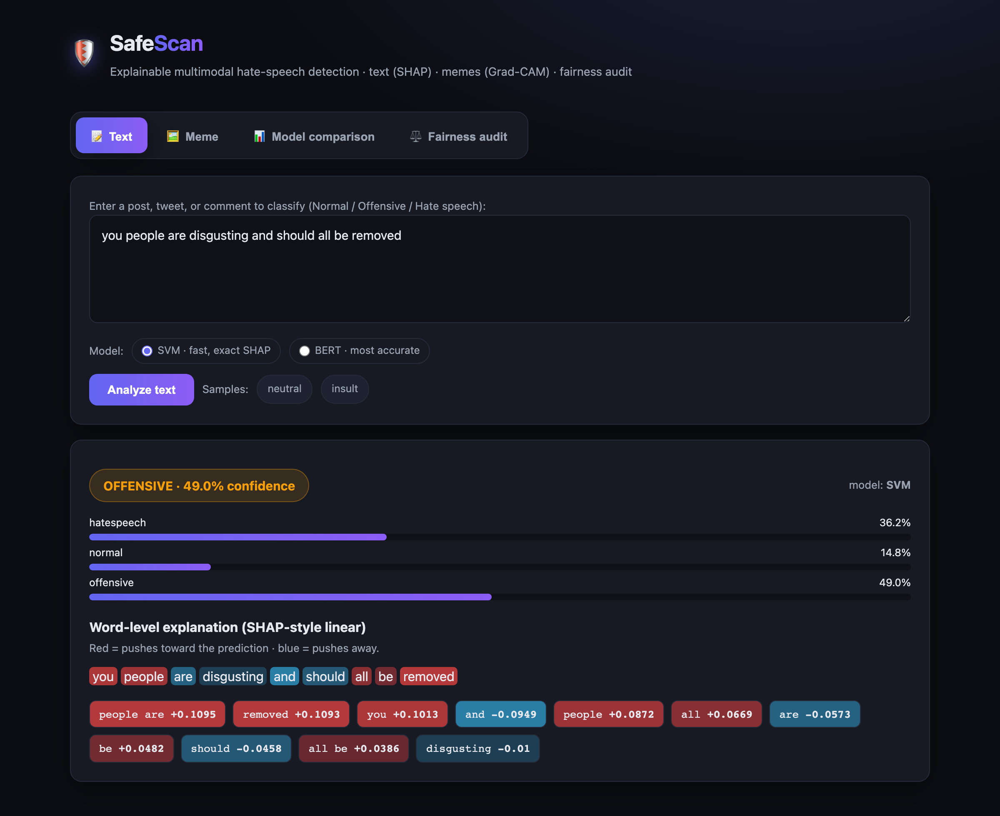

# 🛡️ SafeScan — Explainable Multimodal Hate Speech Detection


[](https://casanovaabhishek14-safescan.hf.space)

SafeScan classifies **text** (Normal / Offensive / Hate speech) and **memes**
(Hateful / Non-hateful), and — crucially — *explains itself*: SHAP-style
word-level attributions for text, Grad-CAM heatmaps for images, plus a
counterfactual **fairness audit** that measures gender bias. Three text models
(SVM, Bi-LSTM, BERT) and a zero-shot CLIP meme pipeline are trained through one
reproducible command and served through a single-page Flask web app.

> MSc Data Science Research Project · University of Leicester · Module MA7443
> Supervisor: Dr. Hammad Afzal

---

## 🌐 Live demo

### ▶️ **[Try it live → casanovaabhishek14-safescan.hf.space](https://casanovaabhishek14-safescan.hf.space)**

Hosted free on Hugging Face Spaces (Docker). **All four tabs are live** — a text classifier
with a **SVM / BERT** model selector (SHAP for SVM, occlusion attribution for BERT), the
CLIP + OCR meme tab (Grad-CAM), model comparison, and the fairness audit. Retrain the models
for free on a GPU — see [docs/TRAINING.md](docs/TRAINING.md).

Or run it locally (see [Quick start](#-quick-start-3-commands)) and open **http://localhost:5000**.

> On macOS, port 5000 is taken by the AirPlay Receiver, so the app serves at
> **http://localhost:5001** there (`PORT=5001 python app.py`).

---

## 🖼️ Screenshot


<!-- Placeholder — run the app (see below), then drop a screenshot at docs/screenshot.png -->

---

## 🚀 Quick start (3 commands)

```bash
pip install -r requirements.txt        # 1. core deps (Flask + SVM + fairness)
python -m src.run_training             # 2. train the SVM & write metrics/fairness
python app.py                          # 3. serve the app  →  http://localhost:5000
```

That's the lightweight path: it trains the **SVM** and powers all four UI tabs
(text analysis, model comparison, fairness audit; the meme tab shows a friendly
"install extras" message).

To enable **Bi-LSTM, BERT, and the CLIP meme pipeline** (larger, GPU-recommended):

```bash
pip install -r requirements-ml.txt     # torch, tensorflow, transformers, pytesseract…
# macOS: brew install tesseract   |   Ubuntu: sudo apt-get install -y tesseract-ocr
python -m src.run_training             # now trains all three text models
```

> **macOS note:** port 5000 is often taken by the AirPlay Receiver. Either disable
> it (System Settings → General → AirDrop & Handoff) or run `PORT=5001 python app.py`.

---

## 🗂️ Project structure

```
SafeScanTool/
├── app.py                     # Flask app — serves UI + /analyze/text, /analyze/meme, APIs
├── templates/index.html       # Single-page frontend (4 tabs, no build step)
├── src/
│   ├── data_utils.py          # Shared load / clean / 80-10-10 split / class weights
│   ├── eval_utils.py          # Metrics + models/metrics.json registry
│   ├── train_svm.py           # SVM (TF-IDF + LinearSVC)      — VERIFIED, runs on CPU
│   ├── train_bilstm.py        # Bi-LSTM (GloVe, early stopping, checkpointing)
│   ├── train_bert.py          # BERT fine-tune (weighted loss, early stopping)
│   ├── run_training.py        # Train all three sequentially
│   ├── clip_meme_pipeline.py  # pytesseract OCR + CLIP zero-shot prompt ensembles
│   ├── explainability.py      # SHAP-style text attributions + CLIP Grad-CAM
│   ├── fairness.py            # Counterfactual gender-bias audit
│   └── config.py             # Env-driven config (no hard-coded secrets)
├── Data/updated_hatexplain_data.csv   # 44,931 labelled posts (3-class)
├── notebooks/                 # Original research notebooks (secrets scrubbed)
├── models/                    # Trained artifacts + metrics.json / fairness.json (git-ignored)
├── requirements.txt           # Core (pinned)
├── requirements-ml.txt        # Deep-learning / multimodal extras (pinned)
├── Dockerfile                 # Container build (core by default)
└── .env.example               # Configuration template
```

---

## 🧠 Models & results

Text is a 3-class problem on a merged **44,931-post** corpus
(offensive 54.9% / normal 28.7% / hate speech 16.4% — imbalanced, so every model
uses **balanced class weights**). All models share an identical stratified
**80/10/10** train/val/test split.

| Model | Accuracy | Macro F1 | Status |
|---|---|---|---|
| **SVM** (TF-IDF word+char, LinearSVC) | **0.77** | **0.74** | ✅ reproduced by this repo |
| Bi-LSTM (GloVe, early stopping) | — | — | run `run_training` (extras) |
| BERT (bert-base-uncased, weighted loss) | — | — | run `run_training` (extras) |
| CLIP + OCR (zero-shot, memes) | — | — | run the meme pipeline |

> The comparison table in the web app reads `models/metrics.json` **live** — it
> only ever shows numbers that training actually produced, never hard-coded ones.
> The SVM row above is measured on the held-out test split (seed 42).

**Fairness (measured on the SVM):** a counterfactual gender-swap audit over 3,000
real posts gives an overall **label flip-rate of ~4.8%** (normal 6.9%,
offensive 2.9%, hate speech 6.8%) — i.e. how often a prediction changes when only
gendered terms are swapped. Regenerate with `python -m src.fairness`.

---

## 🔬 What each piece does

- **Text analysis** (`/analyze/text`) → predicted label, class probabilities, and
  signed word-level attributions. Because LinearSVC is linear over TF-IDF, each
  token's contribution is computed exactly (`coef × tf-idf`) — the SHAP value of a
  linear model, with no sampling.
- **Meme analysis** (`/analyze/meme`) → pytesseract extracts the caption, CLIP
  scores the image against **engineered prompt ensembles** (many "hateful" vs
  "non-hateful" templates, averaged) plus caption-aware prompts, and Grad-CAM
  overlays the image regions driving the "hateful" score.
- **Fairness audit** → counterfactual gender-term substitution + flip-rate.

---

## ⚙️ Tech stack

**ML/NLP:** scikit-learn · TensorFlow · PyTorch · HuggingFace Transformers · CLIP
`openai/clip-vit-base-patch32` · GloVe
**Explainability & fairness:** linear SHAP attributions · Grad-CAM · counterfactual testing
**OCR:** pytesseract (local, no API keys)
**App:** Flask · vanilla-JS single-page UI

---

## 📊 Datasets

The bundled `Data/updated_hatexplain_data.csv` is the merged text corpus. The
Facebook Hateful Memes images require registration with Meta AI and are **not**
included — see [`Data/README.md`](Data/README.md).

---

## 🔐 Security note

Earlier notebook versions contained hard-coded API keys; these have been removed
from the working tree and must be treated as **compromised/rotated**. All runtime
configuration now flows through `.env` (see `.env.example`), and `.env` is
git-ignored. The default meme pipeline is fully local (pytesseract) and needs no keys.

---

## ⚠️ Limitations

Automated hate-speech detection is imperfect and context-dependent. These models
carry dataset biases (documented by the fairness audit), can misfire on reclaimed
language, irony, and dialect, and should support — not replace — human moderation.

---

## 👥 Authors

| Name | Email |
|---|---|
| Nikhil Ayyappan Nair | nan16@student.le.ac.uk |
| Abhishek Kumar Pal | akp33@student.le.ac.uk |
| Sahil Dinesh Padwal | sdp20@student.le.ac.uk |

**Supervisor:** Dr. Hammad Afzal · School of Computing and Mathematical Sciences,
University of Leicester

## 📄 License

For academic purposes. Please cite appropriately if building upon this work.
